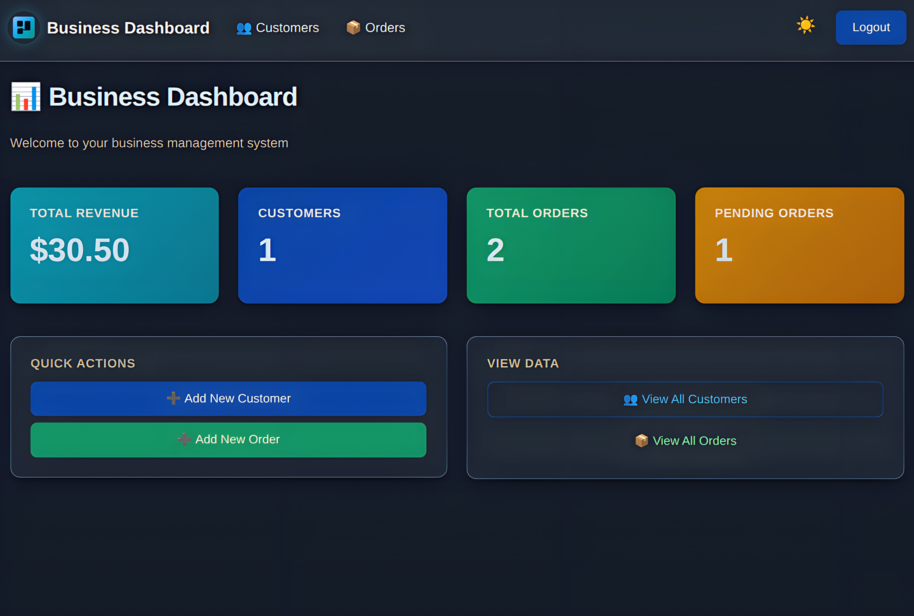

<div align=center>

# 


[](https://www.python.org/)
[](https://flask.palletsprojects.com/)
[]()

A production-ready customer and order management system built with Flask and SQLAlchemy. Multi-user support, role-based data isolation, password reset via email, and a clean dashboard interface.

---
</div>

## Description

Business Dashboard is a CRUD app I built because I needed something simple to manage customers and orders without the bloat of enterprise software. Most business management tools are either too complex (Salesforce, anyone?) or too simplistic (glorified spreadsheets). I wanted something in between: a straightforward web interface with user accounts, email notifications, and actual data validation.

The app handles the basics well: create customers, track orders, see your revenue at a glance. Each user's data is completely isolated—you only see your own customers and orders. Pagination works, forms validate properly, and password resets actually send emails instead of just logging to console.

Built this to understand Flask blueprints, SQLAlchemy relationships, and how to structure a multi-user app without making a mess. It's not trying to be Shopify, but it works reliably for small businesses or freelancers who need to track client work.

---



---

## Table of Contents

- [Quick Start](#quick-start)
- [Features](#features)
- [Tech Stack](#tech-stack)
- [Installation & Setup](#installation--setup)
  - [Prerequisites](#prerequisites)
  - [Setup Steps](#setup-steps)
  - [Environment Variables](#environment-variables)
- [Configuration](#configuration)
  - [Required Variables](#required-variables)
  - [Config Classes](#config-classes)
- [Usage](#usage)
  - [Creating an Account](#creating-an-account)
  - [Managing Customers](#managing-customers)
  - [Creating Orders](#creating-orders)
  - [Dashboard Overview](#dashboard-overview)
- [Project Structure](#project-structure)
- [Database Schema](#database-schema)
  - [Tables](#tables)
  - [Relationships](#relationships)
- [Key Routes](#key-routes)
  - [Public Routes](#public-routes-no-login-required)
  - [Protected Routes](#protected-routes-login-required)
- [Security Features](#security-features)
- [Architecture Decisions](#architecture-decisions)
  - [Blueprint Organization](#blueprint-organization)
  - [Form Validation Strategy](#form-validation-strategy)
  - [Data Isolation](#data-isolation)
  - [User Loading Mechanism](#user-loading-mechanism)
- [Production Deployment](#production-deployment)
  - [Gunicorn Configuration](#gunicorn-configuration)
  - [Reverse Proxy Setup](#reverse-proxy-setup-nginx)
  - [systemd Service](#systemd-service)
- [What I Learned](#what-i-learned)
- [Troubleshooting](#troubleshooting)
- [License](#license)

---

## Quick Start
```bash
# Clone and setup
git clone <repository-url>
cd business-dashboard
python -m venv venv
source venv/bin/activate  # or venv\Scripts\activate on Windows
pip install -r requirements.txt

# Setup environment variables
cat > .env << EOF
SECRET_KEY=$(python -c "import secrets; print(secrets.token_hex(32))")
DATABASE_URL=sqlite:///instance/business.db
FLASK_ENV=development
MAIL_SERVER=smtp.gmail.com
BUSINESS_DASHBOARD_EMAIL=your-email@gmail.com
BUSINESS_DASHBOARD_EMAIL_PASSWORD=your-app-password
EOF

# Initialize database and run
flask db upgrade
python run.py
# Visit http://localhost:5000
```

---

## Features

- ✅ **Multi-user authentication** – Each user has isolated customer/order data
- ✅ **Customer management** – Full CRUD with email validation
- ✅ **Order tracking** – Link orders to customers, track status and revenue
- ✅ **Dashboard stats** – Total customers, orders, pending orders, and revenue at a glance
- ✅ **Password reset via email** – Secure token-based recovery (1-hour expiry)
- ✅ **Pagination** – Handle large datasets without breaking the UI
- ✅ **Form validation** – WTForms with custom validators (duplicate email checks, order number conflicts)
- ✅ **Data isolation** – Users can only access their own data (enforced at the query level)
- ✅ **Foreign key protection** – Can't delete customers who have existing orders
- ✅ **Responsive design** – Works on mobile and desktop

---

## Tech Stack

| Layer | Technology | Purpose |
|-------|------------|---------|
| **Backend** | Python, Flask | Web framework |
| **Database** | SQLAlchemy, SQLite | ORM and persistent storage |
| **Migrations** | Flask-Migrate (Alembic) | Database schema versioning |
| **Forms** | Flask-WTF, WTForms | Form handling and CSRF protection |
| **Authentication** | Werkzeug, itsdangerous | Password hashing, secure tokens |
| **Email** | Flask-Mail | Password reset emails |
| **Frontend** | Jinja2, Bootstrap | Templates and styling |

### Why This Stack?

**Flask** – Lightweight, flexible, doesn't impose architecture decisions  
**SQLAlchemy** – Powerful ORM with relationship handling and migrations  
**WTForms** – Server-side validation with reusable form classes  
**SQLite** – Zero-config database perfect for small-to-medium deployments  
**Flask-Migrate** – Handles schema changes without manual SQL

---

## Installation & Setup

### Prerequisites

- Python 3.7+
- Git
- SMTP server access (Gmail works out of the box)

### Setup Steps

```bash
# 1. Clone and create virtual environment
git clone <repository-url>
cd business-dashboard
python -m venv venv
source venv/bin/activate   # macOS/Linux
# venv\Scripts\activate    # Windows

# 2. Install dependencies
pip install -r requirements.txt

# 3. Create .env file (see Environment Variables below)

# 4. Initialize database
flask db upgrade

# 5. Run the app
python run.py  # Development (port 5000)
# gunicorn run:app  # Production (port 8000)
```

### Environment Variables

Create a `.env` file in the project root:
```bash
SECRET_KEY=your-secret-key-here  # Generate: python -c "import secrets; print(secrets.token_hex(32))"
DATABASE_URL=sqlite:///instance/business.db
FLASK_ENV=development

# Email configuration
MAIL_SERVER=smtp.gmail.com
BUSINESS_DASHBOARD_EMAIL=your-email@gmail.com
BUSINESS_DASHBOARD_EMAIL_PASSWORD=your-gmail-app-password
```

**Getting a Gmail App Password:**
1. Enable 2FA on your Google account
2. Go to: Google Account → Security → 2-Step Verification → App passwords
3. Generate a new app password for "Mail"
4. Use that 16-character password in `.env`

---

## Configuration

### Required Variables

| Variable | Description |
|----------|-------------|
| `SECRET_KEY` | Flask session encryption key (64 chars recommended) |
| `DATABASE_URL` | Database connection string (default: `sqlite:///dev.db` in dev) |
| `MAIL_SERVER` | SMTP server address (e.g., `smtp.gmail.com`) |
| `BUSINESS_DASHBOARD_EMAIL` | Email address for sending |
| `BUSINESS_DASHBOARD_EMAIL_PASSWORD` | Email password or app-specific password |

### Config Classes

The app uses different configs for development and production in `app/config.py`:

**DevelopmentConfig:**
- Debug mode enabled, auto-reload on code changes
- Uses SQLite with default path: `sqlite:///dev.db`
- Detailed error pages

**ProductionConfig:**
- Debug mode disabled, generic error pages
- Requires `DATABASE_URL` environment variable
- Can use PostgreSQL or MySQL

Switch by setting `FLASK_ENV`:
```bash
export FLASK_ENV=development  # or production
```

**Startup validation:** Config checks for missing required variables and prints warnings:
```python
for name in ["MAIL_USERNAME", "MAIL_PASSWORD", "MAIL_DEFAULT_SENDER", "MAIL_SERVER"]:
    if getattr(Config, name) is None:
        print(f"Missing: {name}")
```

---

## Usage

### Creating an Account

1. Visit the homepage and click **"Sign Up"**
2. Enter your name, email, and password
3. Password requirements: 6+ characters, 1 letter, 1 number, 1 special character
4. Click **"Sign Up"** – you'll be automatically logged in

### Managing Customers

**Add a customer:**
1. Click **"Customers"** → **"Add Customer"**
2. Fill in: Name (required), Email (unique), Phone, Company
3. Click **"Save Customer"**

**Edit/Delete:**
- Click **Edit** to update customer details
- Click **Delete** to remove (blocked if customer has orders)

### Creating Orders

1. Click **"Orders"** → **"Add Order"**
2. Fill in: Order ID (unique), Customer, Product, Quantity, Price, Status
3. Click **"Save Order"**

**Note:** You must have at least one customer before creating orders.

### Dashboard Overview

The main dashboard shows four key metrics:

| Metric | Description |
|--------|-------------|
| **Total Customers** | Count of all your customers |
| **Total Orders** | Count of all orders across all customers |
| **Pending Orders** | Orders with "pending" status |
| **Total Revenue** | Sum of (quantity × price) for all orders |

### Password Reset

1. Click **"Forgot Password?"** on the login page
2. Enter your email address
3. Check your email for a reset link (valid for 1 hour)
4. Click the link, enter your new password, and confirm

**Security note:** The app always shows "email sent" even if the address isn't registered (prevents email enumeration attacks).

---

## Project Structure
```
business-dashboard/
│
├── app/
│   ├── __init__.py              # Application factory
│   ├── config.py                # Config classes (Dev/Prod)
│   ├── extensions.py            # Flask extensions (db, mail, migrate)
│   ├── mail_utils.py            # Email utilities
│   │
│   ├── auth/                    # Authentication blueprint
│   │   ├── routes.py           # Login, signup, password reset
│   │   ├── decorators.py       # @login_required decorator
│   │   └── utils.py            # current_user() helper
│   │
│   ├── models/                  # Database models
│   │   ├── user.py             # User + password helpers
│   │   ├── customer.py         # Customer model
│   │   └── order.py            # Order model with total_amount property
│   │
│   ├── forms/                   # WTForms classes
│   │   ├── auth_forms.py       # SignUp, Login, ForgotPassword, ResetPassword
│   │   ├── customer.py         # CustomerCreate, CustomerEdit
│   │   └── order.py            # OrderCreate, OrderEdit
│   │
│   ├── routes/                  # Route blueprints
│   │   ├── main.py             # Dashboard (index_bp)
│   │   ├── customers.py        # Customer CRUD (customers_bp)
│   │   └── orders.py           # Order CRUD (orders_bp)
│   │
│   ├── templates/               # Jinja2 templates
│   │   ├── layout.html         # Base template
│   │   ├── index.html          # Dashboard
│   │   ├── customers.html      # Customer list
│   │   ├── orders.html         # Order list
│   │   └── auth/               # Auth templates
│   │
│   └── static/                  # CSS, JS, images
│
├── instance/                    # Instance files
│   └── business.db             # SQLite database
│
├── migrations/                  # Alembic migrations
│
├── run.py                      # Entry point with before_request hooks
├── gunicorn.conf.py            # Production config
├── requirements.txt            # Dependencies
└── .env                        # Environment variables (gitignored)
```

---

## Database Schema

### Tables

**users**
```sql
CREATE TABLE users (
    id INTEGER PRIMARY KEY AUTOINCREMENT,
    name VARCHAR(200) NOT NULL,
    email VARCHAR(50) UNIQUE NOT NULL,
    password_hash VARCHAR NOT NULL,
    created_at DATETIME DEFAULT CURRENT_TIMESTAMP
);
```

**customer**
```sql
CREATE TABLE customer (
    id INTEGER PRIMARY KEY AUTOINCREMENT,
    user_id INTEGER NOT NULL,
    name VARCHAR(100) NOT NULL,
    email VARCHAR(120) UNIQUE NOT NULL,
    phone VARCHAR(20),
    company VARCHAR(100),
    created_at DATETIME DEFAULT CURRENT_TIMESTAMP,
    FOREIGN KEY (user_id) REFERENCES users(id)
);
```

**order**
```sql
CREATE TABLE "order" (
    id INTEGER PRIMARY KEY AUTOINCREMENT,
    order_number VARCHAR(50) UNIQUE NOT NULL,
    customer_id INTEGER NOT NULL,
    product VARCHAR(200) NOT NULL,
    quantity INTEGER NOT NULL DEFAULT 1,
    price FLOAT NOT NULL DEFAULT 0.0,
    status VARCHAR(50) DEFAULT 'pending',
    created DATETIME DEFAULT CURRENT_TIMESTAMP,
    FOREIGN KEY (customer_id) REFERENCES customer(id)
);
```

**Order model includes a computed property:**
```python
@property
def total_amount(self):
    return self.quantity * self.price
```

### Relationships

**One-to-Many:**
- User → Customers (one user has many customers)
- Customer → Orders (one customer has many orders)

**Key Constraints:**
- User emails must be unique globally
- Customer emails must be unique globally
- Order numbers must be unique per user (enforced in forms)
- Cannot delete customers with existing orders (enforced in routes)

---

## Key Routes

### Public Routes (no login required)

| Method | Route | Description |
|--------|-------|-------------|
| `GET/POST` | `/signup` | Registration |
| `GET/POST` | `/login` | Login |
| `GET/POST` | `/forgot_password` | Password reset request |
| `GET/POST` | `/reset_password/<token>` | Password reset form |

### Protected Routes (login required)

**Dashboard & Auth:**

| Method | Route | Description |
|--------|-------|-------------|
| `GET` | `/` | Dashboard with stats |
| `POST` | `/logout` | Clear session and log out |

**Customers:**

| Method | Route | Description |
|--------|-------|-------------|
| `GET` | `/customers` | List all customers (paginated) |
| `GET/POST` | `/customers/new` | Create customer |
| `GET/POST` | `/customers/<id>/edit` | Edit customer |
| `POST` | `/customers/<id>/delete` | Delete customer |

**Orders:**

| Method | Route | Description |
|--------|-------|-------------|
| `GET` | `/orders` | List all orders (paginated) |
| `GET/POST` | `/orders/new` | Create order |
| `GET/POST` | `/orders/<id>/edit` | Edit order |
| `POST` | `/orders/<id>/delete` | Delete order |

---

## Security Features

- ✅ **Password hashing** – Werkzeug's `generate_password_hash` with salt
- ✅ **CSRF protection** – Flask-WTF on all forms
- ✅ **Secure password reset** – Time-limited tokens (1 hour) using `itsdangerous`
- ✅ **User enumeration prevention** – Password reset always shows "email sent"
- ✅ **Data isolation** – Users can only access their own data via query filters
- ✅ **SQL injection protection** – SQLAlchemy parameterized queries
- ✅ **XSS protection** – Jinja2 auto-escapes all variables
- ✅ **Password complexity** – Enforced via regex validators
- ✅ **Foreign key checks** – Prevent orphaned records

### How Data Isolation Works

Every query for customers or orders includes the `user_id` filter:

```python
# Customers
customers = Customer.query.filter_by(user_id=user.id).all()

# Orders (with join)
orders = Order.query.join(Customer).filter(Customer.user_id == user.id).all()

# Edit/delete routes
customer = Customer.query.filter(
    Customer.id == id, 
    Customer.user_id == user.id
).first_or_404()
```

This ensures User A can never access User B's data, even if they guess the ID.

---

## Architecture Decisions

### Blueprint Organization

The app uses Flask blueprints to separate concerns:

- **`auth` blueprint** – All authentication-related routes
- **`index` blueprint** – Dashboard homepage
- **`customers` blueprint** – Customer CRUD
- **`orders` blueprint** – Order CRUD

**Benefits:** Routes are organized by feature, URL prefixes defined once, easy to test in isolation.

### Form Validation Strategy

Forms inherit from base classes to avoid duplication:

```python
class BaseForm(FlaskForm):
    name = StringField('Name', validators=[DataRequired()])
    email = StringField('Email', validators=[DataRequired(), Email()])

class CustomerCreate(BaseForm):
    submit = SubmitField('Save Customer')
    
    def validate_email(self, email):
        customer = Customer.query.filter_by(email=email.data).first()
        if customer:
            raise ValidationError("Email is connected to another customer")

class CustomerEdit(BaseForm):
    submit = SubmitField('Update Customer')
    
    def __init__(self, customer=None, *args, **kwargs):
        super().__init__(*args, **kwargs)
        self.customer = customer
    
    def validate_email(self, email):
        customer = Customer.query.filter(
            Customer.email == email.data, 
            self.customer.id != Customer.id
        ).first()
        if customer:
            raise ValidationError('Email is connected to another customer')
```

**Why this works:**
- `CustomerCreate` checks for any duplicate email
- `CustomerEdit` excludes the current customer from duplicate check
- Shared fields defined once in `BaseForm`

**Dynamic form choices** for order forms:
```python
class OrderCreate(BaseForm):
    customer_id = SelectField('Customer', coerce=int)
    
    def __init__(self, user_id=None, *args, **kwargs):
        super().__init__(*args, **kwargs)
        if user_id:
            self.customer_id.choices = [
                (c.id, c.name) 
                for c in Customer.query.filter(Customer.user_id == user_id).all()
            ]
```

This prevents User A from seeing User B's customers in the dropdown.

### Data Isolation

Order numbers must be unique per user (not globally):

```python
def validate_order_number(self, order_number):
    order = Order.query.join(Customer).filter(
        Order.order_number == order_number.data,
        Customer.user_id == self.user_id
    ).first()
    if order:
        raise ValidationError('Order number already registered.')
```

This allows different users to use the same order number scheme (e.g., "ORD-001") without conflicts.

### User Loading Mechanism

The `run.py` file handles user loading before each request:

```python
@app.before_request
def activate_current_user():
    """Load current user before each request"""
    user_id = session.get("user_id")
    g.user = db.session.get(User, user_id) if user_id else None

@app.context_processor
def inject_user():
    """Make current_user available in all templates"""
    return dict(current_user=g.user)
```

This ensures `g.user` is always available in routes without repeated database queries, and `current_user` is available in all templates.

---

## Production Deployment

### Gunicorn Configuration

The `gunicorn.conf.py` has production-ready defaults with environment variable overrides:

```python
import os

bind = os.getenv("GUNICORN_BIND", "0.0.0.0:8000")
workers = int(os.getenv("GUNICORN_WORKERS", 4))
timeout = int(os.getenv("GUNICORN_TIMEOUT", 30))

accesslog = "-"
errorlog = "-"
```

**Starting:**
```bash
gunicorn run:app  # Default settings
gunicorn --config gunicorn.conf.py run:app  # Explicit config
GUNICORN_WORKERS=8 gunicorn run:app  # Override via env vars
```

### Reverse Proxy Setup (nginx)

```nginx
upstream business_dashboard {
    server 127.0.0.1:8000;
}

server {
    listen 80;
    server_name yourdomain.com;
    return 301 https://$server_name$request_uri;
}

server {
    listen 443 ssl http2;
    server_name yourdomain.com;

    ssl_certificate /etc/letsencrypt/live/yourdomain.com/fullchain.pem;
    ssl_certificate_key /etc/letsencrypt/live/yourdomain.com/privkey.pem;

    location / {
        proxy_pass http://business_dashboard;
        proxy_set_header Host $host;
        proxy_set_header X-Real-IP $remote_addr;
        proxy_set_header X-Forwarded-For $proxy_add_x_forwarded_for;
        proxy_set_header X-Forwarded-Proto $scheme;
    }

    location /static {
        alias /var/www/business-dashboard/app/static;
        expires 30d;
    }
}
```

**Get SSL certificate:**
```bash
sudo apt-get install certbot python3-certbot-nginx
sudo certbot --nginx -d yourdomain.com
```

### systemd Service

Create `/etc/systemd/system/business-dashboard.service`:
```ini
[Unit]
Description=Business Dashboard
After=network.target

[Service]
User=www-data
WorkingDirectory=/var/www/business-dashboard
Environment="PATH=/var/www/business-dashboard/venv/bin"
EnvironmentFile=/var/www/business-dashboard/.env
ExecStart=/var/www/business-dashboard/venv/bin/gunicorn --config gunicorn.conf.py run:app

[Install]
WantedBy=multi-user.target
```

**Enable and start:**
```bash
sudo systemctl enable business-dashboard
sudo systemctl start business-dashboard
```

---

## What I Learned

### The Join Query Pattern

Initially doing N+1 queries:
```python
user_customers = Customer.query.filter_by(user_id=user.id).all()
for customer in user_customers:
    orders = Order.query.filter_by(customer_id=customer.id).all()  # N+1!
```

Learned to use joins:
```python
orders = Order.query.join(Customer).filter(Customer.user_id == user.id).all()
```

Much faster and cleaner.

### Form Validation Subtleties

WTForms' custom validators required understanding:
1. Method must be named `validate_<field_name>`
2. Automatically called during `form.validate_on_submit()`
3. Raise `ValidationError` to display error message
4. Edit forms need extra context to exclude current record from duplicate checks

### The Orphan Delete Problem

Original code allowed deleting customers with orders. Fix:
```python
if Order.query.filter_by(customer_id=id).first():
    flash("Cannot delete customer with existing orders.", "danger")
    return redirect(url_for("customers.customers"))
```

Better than relying on database-level cascade rules.

### Flask-Migrate Is Essential

Early on, I manually edited the database for schema changes. Flask-Migrate is magic:
```bash
# Change model
class Customer(db.Model):
    company = db.Column(db.String(100))  # Added field

# Generate and apply migration
flask db migrate -m "Add company field"
flask db upgrade
```

Migrations are version-controlled, reversible, and shareable.

### Production Readiness Is About Structure

Refactoring from single-file to blueprints made deployment possible. The actual business logic didn't change much—the structure changed everything. Each blueprint can be tested independently, config can be injected, and Gunicorn can run multiple workers.

---

## Troubleshooting

### "ModuleNotFoundError: No module named 'app'"
**Problem:** Running from wrong directory  
**Solution:** `cd /path/to/business-dashboard && python run.py`

### "RuntimeError: Missing required environment variables"
**Problem:** Environment variables not set  
**Solution:** Check `.env` has: `SECRET_KEY`, `DATABASE_URL`, `MAIL_SERVER`, `BUSINESS_DASHBOARD_EMAIL`, `BUSINESS_DASHBOARD_EMAIL_PASSWORD`

If you see "Missing: MAIL_USERNAME" on startup, it means `BUSINESS_DASHBOARD_EMAIL` is not set.

### "No such table: users"
**Problem:** Database not initialized  
**Solution:** `flask db upgrade`

### "SMTPAuthenticationError"
**Problem:** Using regular Gmail password instead of app password  
**Solution:** Generate app-specific password in Google Account settings (requires 2FA)

### "Cannot delete customer with existing orders"
**Problem:** Customer has orders  
**Solution:** Delete orders first, then delete customer

### "Email is connected to another customer"
**Problem:** Email already registered  
**Solution:** Use a different email address

### Password reset email not sending
**Solution:**
1. Verify SMTP settings in `.env`
2. Check spam folder
3. Verify `BUSINESS_DASHBOARD_EMAIL` is set correctly

### Users seeing each other's data
**Problem:** Missing `user_id` filter  
**Solution:** Always include user filter:
```python
customers = Customer.query.filter_by(user_id=user.id).all()
```

---

## License

MIT License – use it, modify it, deploy it, sell it. Do whatever you want with it.